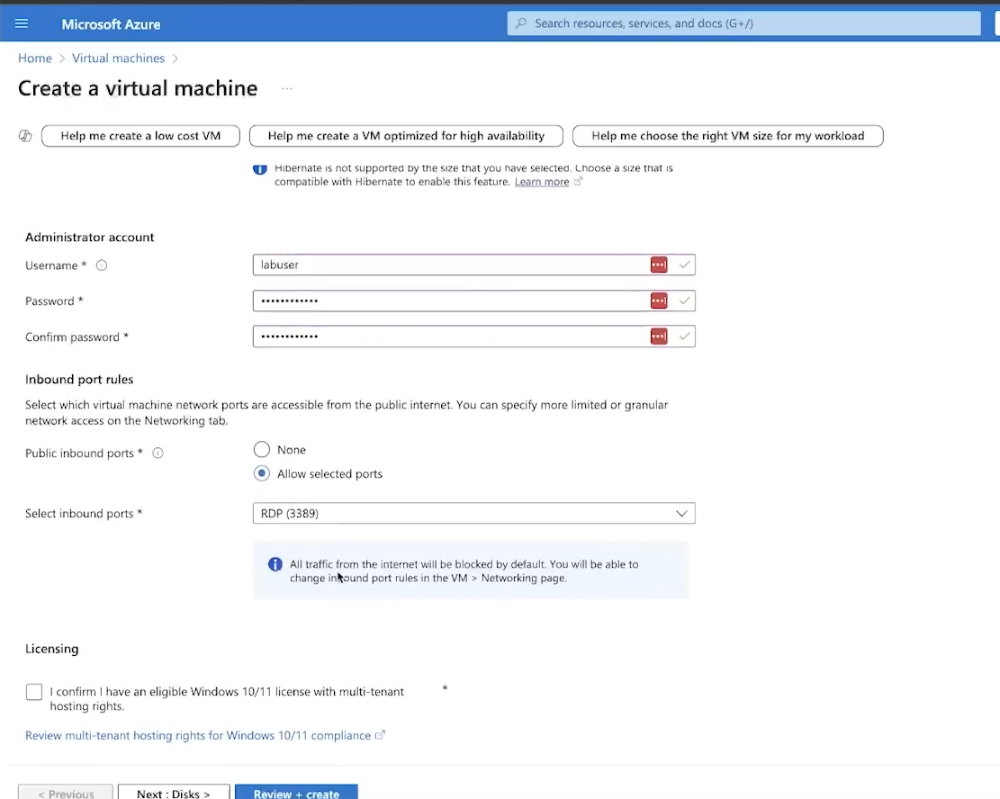
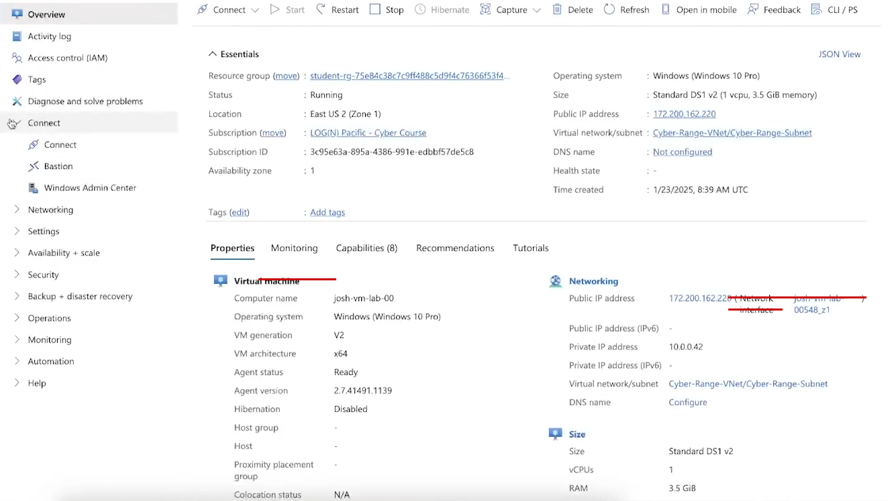
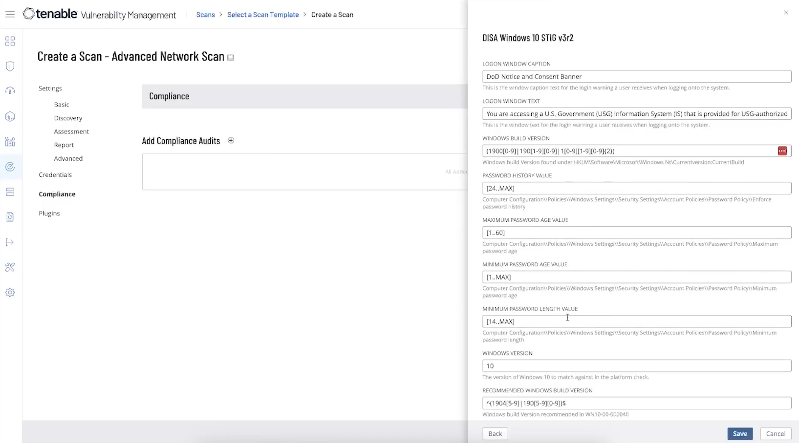
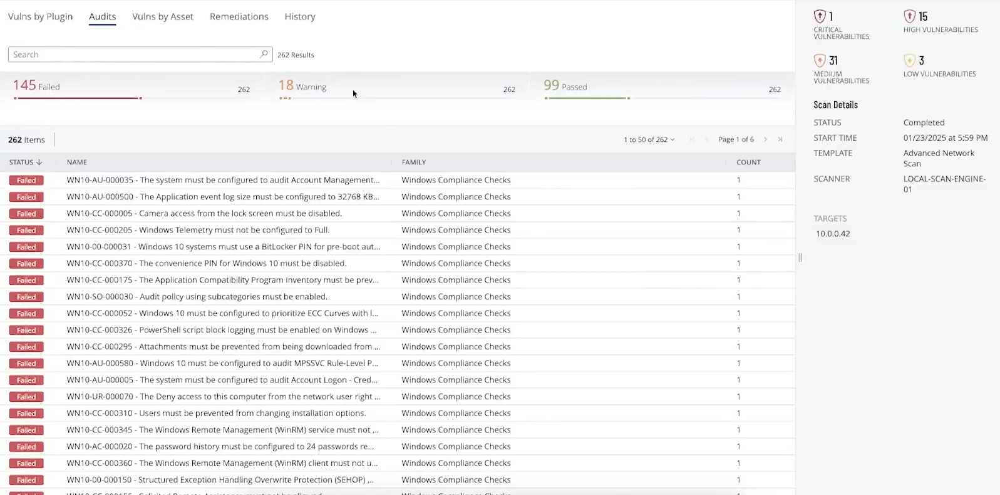
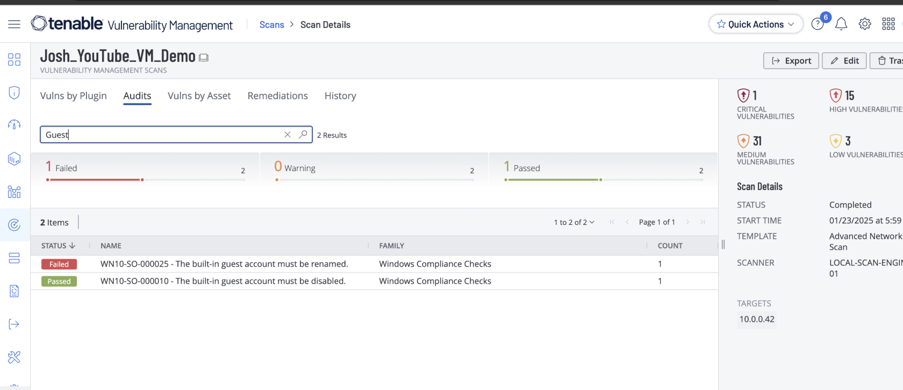
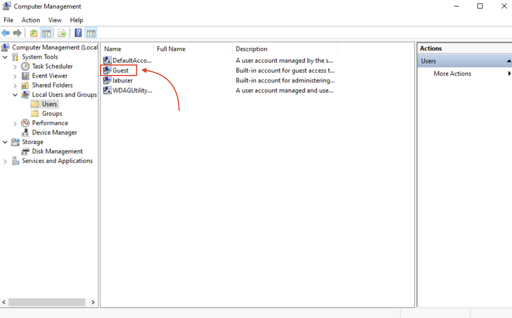
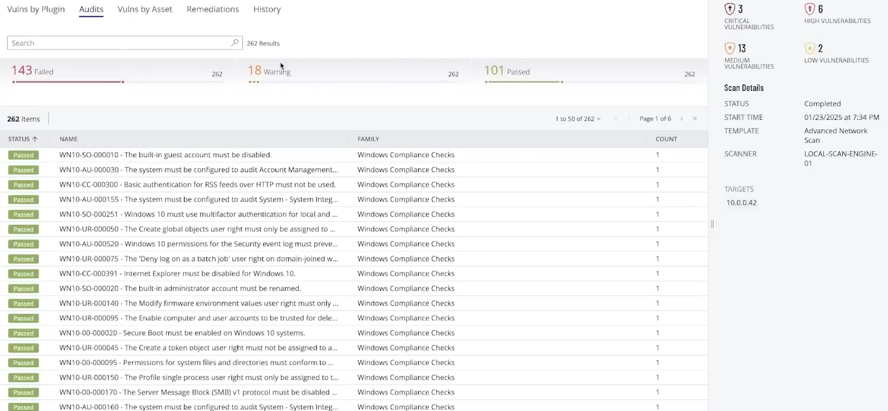
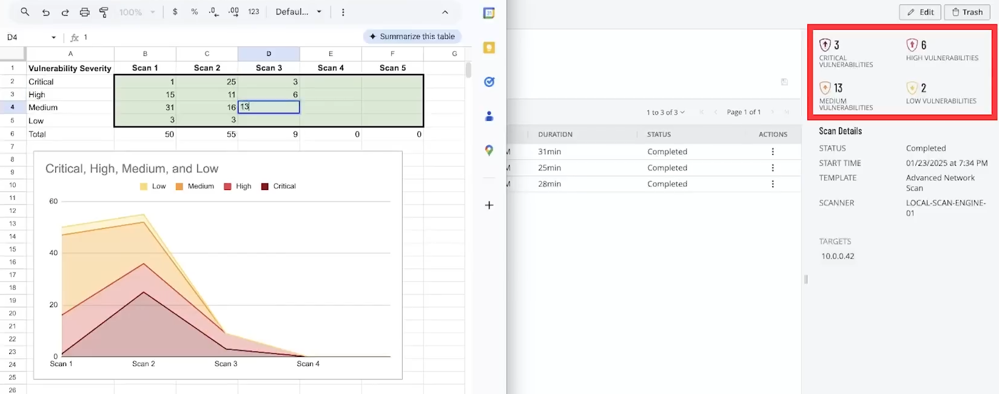

# Vulnerability Management Lab with Tenable

Welcome to my **Vulnerability Management Lab**! This repository documents a hands-on lab where I used Tenable's vulnerability scanning platform to identify, track, and remediate security misconfigurations on a Windows 10 virtual machine, guided by DISA STIG compliance benchmarks.

---

### Lab Architecture and Overview

This lab is cloud-based and reproducible from any machine. Both the Tenable scan engine and the scan target (a Windows 10 VM) were hosted on Microsoft Azure, with Tenable Vulnerability Management used as the main scanning and reporting console.

*Provisioning the Windows 10 VM in Azure — configuring the admin account and restricting inbound access to RDP only.*

*The running VM in Azure, showing its private/public IP addresses and network configuration used as the scan target.*

---

### Key Concepts Covered

- **Vulnerability Management Fundamentals**
  - What vulnerability management is and why it matters
  - Scan engines, credentialed scanning, and remediation workflows
  - Compliance frameworks — specifically DISA STIG

- **Hands-On Steps**
  - Standing up a Windows 10 VM as a scan target
  - Configuring a Tenable scan with the DISA Windows 10 STIG v3r2 compliance audit
  - Running baseline and follow-up scans
  - Identifying failed compliance checks and remediating them
  - Tracking vulnerability counts across multiple scans

- **Tools Used**
  - Microsoft Azure (VM hosting)
  - Tenable Vulnerability Management
  - Windows Computer Management (local user/group configuration)
  - Google Sheets (vulnerability trend tracking)

---

### Lab Workflow

**1. Scan Configuration**

I configured a credentialed Tenable Advanced Network Scan against the target VM, adding the **DISA Windows 10 STIG v3r2** compliance audit alongside standard vulnerability checks.

*Setting DISA STIG v3r2 audit parameters — logon banner text, password policy values, and Windows build version requirements.*

**2. Initial Baseline Scan**

The first scan surfaced **145 failed**, 18 warning, and 99 passed checks out of 262 total, along with 1 critical, 15 high, 31 medium, and 3 low vulnerabilities.

*Baseline scan results — 145 failed compliance checks against the DISA Windows 10 STIG.*

**3. Investigating a Specific Finding — Guest Account**

Two STIG checks specifically dealt with the built-in Guest account:
- **WN10-SO-000010** — the built-in guest account must be disabled *(Passed)*
- **WN10-SO-000025** — the built-in guest account must be renamed *(Failed)*

*Filtering scan results for "Guest" — the account was disabled but not yet renamed.*

I reviewed the account directly in Windows Computer Management to confirm its state before remediating.

*Local Users and Groups showing the built-in Guest account prior to remediation.*

**4. Remediation and Re-Scan**

After renaming the Guest account and addressing other failed checks, a follow-up scan showed improvement: **143 failed**, 18 warning, and **101 passed** — with a corresponding drop to 3 critical, 6 high, 13 medium, and 2 low vulnerabilities.

*Re-scan results after remediation — passed checks increased and vulnerability severity counts dropped.*

**5. Tracking Progress Across Multiple Scans**

I logged results from each scan into a spreadsheet to visualize the trend in vulnerability counts by severity over time.

*Tracking critical, high, medium, and low vulnerability counts across five scans, charted to show the remediation trend.*

---

### Why This Lab?

This lab gave me hands-on experience with the full vulnerability management lifecycle — configuring a credentialed scan, applying a real DoD compliance benchmark (DISA STIG), interpreting scan results, remediating specific misconfigurations, and verifying the fix with a re-scan. Skills reinforced:

- Reading and acting on DISA STIG compliance findings
- Credentialed scanning setup in Tenable Vulnerability Management
- Windows local account/security configuration
- Documenting and tracking remediation progress over time

---

### Repository Contents

| File | Description |
|---|---|
| `images/01-azure-vm-setup.png` | Azure VM creation — admin account and inbound port rules |
| `images/02-tenable-scan-config-stig.png` | Tenable scan configuration with DISA Windows 10 STIG v3r2 |
| `images/03-azure-vm-overview.png` | Running VM overview in Azure |
| `images/04-tenable-initial-scan-results.png` | Baseline scan results |
| `images/05-tenable-second-scan-results.png` | Post-remediation scan results |
| `images/06-vulnerability-tracking-spreadsheet.png` | Vulnerability trend tracking across scans |
| `images/07-local-users-guest-account.png` | Local Users and Groups — Guest account |
| `images/08-tenable-guest-audit-filter.png` | Filtered audit results for Guest account checks |
